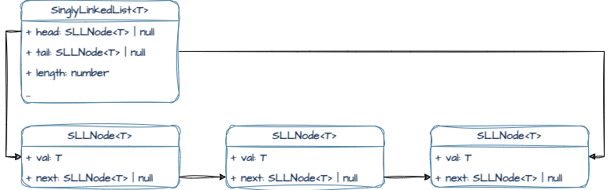
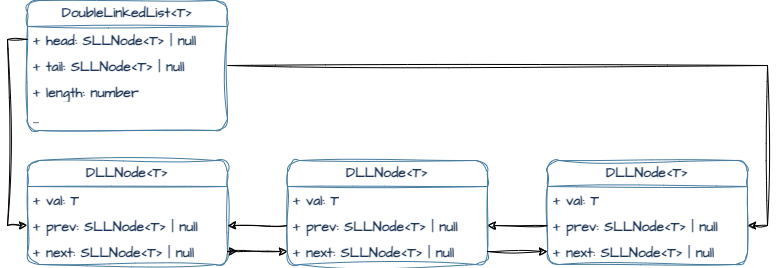

# Structurify
This JavaScript/TypeScript module is a collection of fundamental data structures used in computer science and software development. It includes implementations of various data structures that can be imported and used in your projects. 
- [Singly Linked List](#singly-linked-list),
- [Doubly Linked List](#doubly-linked-list),
- [Queue](#queue),
- [Stack](#stack),
- [Binary Tree](#binary-tree),
- [Binary Search Tree](#binary-search-tree)

## Singly Linked List
A linear data structure where elements (nodes) are linked in a sequential manner, each pointing to the next node in the sequence.
- Provides methods for insertion, deletion, traversal, and access.
- Useful for scenarios requiring efficient insertion and deletion at the beginning or end of the list.



### `SinglyLinkedList<T>`

#### Properties:
- `private head: SLLNode<T> | null`: Represents the head node of the linked list.
- `private tail: SLLNode<T> | null`: Represents the tail node of the linked list.
- `private length: number`: Represents the count of nodes in the linked list.

#### Getters:
- `headNode: SLLNode<T> | null`: Gets the head node of the linked list.
- `tailNode: SLLNode<T> | null`: Gets the tail node of the linked list.
- `size: number`: Gets the length of the linked list.

#### Methods:
- `static fromArray<T>(data: T[]): SinglyLinkedList<T>`: Creates a new singly linked list from an array of data.
- `push(val: T): SinglyLinkedList<T>`: Adds a new node with the given value to the end of the linked list.
- `pop(): T | undefined`: Removes and returns the last node from the linked list.
- `shift(): T | undefined`: Removes and returns the first node from the linked list.
- `unshift(val: T): SinglyLinkedList<T>`: Adds a new node with the given value to the beginning of the linked list.
- `get(index: number): T | undefined`: Gets the value at a specific index in the linked list.
- `getNode(index: number): SLLNode<T> | null`: Gets the node at a specific index in the linked list.
- `set(index: number, val: T): boolean`: Sets the value at a specific index in the linked list.
- `insert(index: number, val: T): boolean`: Inserts a new node with the given value at a specific index in the linked list.
- `remove(index: number): T | undefined`: Removes and returns a node at a specific index in the linked list.
- `clear(): void`: Clears the entire linked list.
- `reverse(): SinglyLinkedList<T>`: Reverses the order of nodes in the linked list.
- `rotate(num: number): SinglyLinkedList<T>`: Rotates the linked list by a specified number of positions.
- `toArray(): T[]`: Converts the linked list into an array and returns it.

### How to use
```ts
// Example usage
import { SinglyLinkedList } from 'structurify';

const myList = new SinglyLinkedList<number>();
myList.push(5).push(10).push(15);

console.log(myList.toArray()); // Output: [5, 10, 15]

myList.pop();
console.log(myList.toArray()); // Output: [5, 10]

// Other operations such as shift, unshift, get, set, insert, remove, reverse, rotate, etc.
```

### Time and Space complexity
| Method               | Time Complexity             | Space Complexity |
|----------------------|-----------------------------|------------------|
| `size`               | O(1)                        | O(1)             |
| `fromArray`          | O(n) (n is length of array) | O(n)             |
| `push(val)`          | O(1)                        | O(1)             |
| `pop()`              | O(n)                        | O(1)             |
| `shift()`            | O(1)                        | O(1)             |
| `unshift(val)`       | O(1)                        | O(1)             |
| `get(index)`         | O(n) (n is index)           | O(1)             |
| `getNode(index)`     | O(n) (n is index)           | O(1)             |
| `set(index, val)`    | O(n) (n is index)           | O(1)             |
| `insert(index, val)` | O(n) (n is index)           | O(1)             |
| `remove(index)`      | O(n) (n is index)           | O(1)             |
| `clear()`            | O(1)                        | O(1)             |
| `reverse()`          | O(n)                        | O(1)             |
| `rotate(num)`        | O(n)                        | O(1)             |
| `toArray()`          | O(n)                        | O(n)             |


## Doubly Linked List
Similar to the Singly Linked List, but each node also has a reference to the previous node, allowing bidirectional traversal.
- Supports insertion, deletion, and traversal from both ends.
- Well-suited for applications needing easy access to previous elements.



### `DoubleLinkedList<T>`

#### Properties:
- `private head: SLLNode<T> | null`: Represents the head node of the linked list.
- `private tail: SLLNode<T> | null`: Represents the tail node of the linked list.
- `private length: number`: Represents the count of nodes in the linked list.

#### Getters:
- `headNode: SLLNode<T> | null`: Gets the head node of the linked list.
- `tailNode: SLLNode<T> | null`: Gets the tail node of the linked list.
- `size: number`: Gets the length of the linked list.

#### Methods:
- **`static fromArray<T>(data: T[]): DoubleLinkedList<T>`**: Creates a new Double Linked List from an array of elements.
- **`push(val: T): DoubleLinkedList<T>`**: Appends an element to the end of the Double Linked List.
- **`pop(): T | undefined`**: Removes and returns the last element from the Double Linked List.
- **`shift(): T | undefined`**: Removes and returns the first element from the Double Linked List.
- **`unshift(val: T): DoubleLinkedList<T>`**: Prepends an element to the beginning of the Double Linked List.
- **`get(index: number): T | undefined`**: Retrieves the element at the specified index in the Double Linked List.
- **`getNode(index: number): DLLNode<T> | null`**: Retrieves the node at the specified index in the Double Linked List.
- **`set(index: number, val: T): boolean`**: Sets the element at the specified index in the Double Linked List.
- **`insert(index: number, val: T): boolean`**: Inserts an element at the specified index in the Double Linked List.
- **`remove(index: number): T | undefined`**: Removes and returns the element at the specified index in the Double Linked List.
- **`reverse(): DoubleLinkedList<T>`**: Reverses the order of elements in the Double Linked List.
- **`toArray(): T[]`**: Converts the Double Linked List to an array of elements.

### How to use
```ts
import { DoubleLinkedList } from 'structurify';

const dll = new DoubleLinkedList<number>();
dll.push(5).push(10).push(15);

console.log(dll.toArray()); // Output: [5, 10, 15]

dll.reverse();
console.log(dll.toArray()); // Output: [15, 10, 5]

dll.remove(1);
console.log(dll.toArray()); // Output: [15, 5]
```

### Time and Space complexity
| Method               | Time Complexity             | Space Complexity |
|----------------------|-----------------------------|------------------|
| `size`               | O(1)                        | O(1)             |
| `fromArray`          | O(n) (n is length of array) | O(n)             |
| `push(val)`          | O(1)                        | O(1)             |
| `pop()`              | O(1)                        | O(1)             |
| `shift()`            | O(1)                        | O(1)             |
| `unshift(val)`       | O(1)                        | O(1)             |
| `get(index)`         | O(n) (n is index)           | O(1)             |
| `getNode(index)`     | O(n) (n is index)           | O(1)             |
| `set(index, val)`    | O(n) (n is index)           | O(1)             |
| `insert(index, val)` | O(n) (n is index)           | O(1)             |
| `remove(index)`      | O(n) (n is index)           | O(1)             |
| `reverse()`          | O(n)                        | O(1)             |
| `toArray()`          | O(n)                        | O(n)             |

## Queue
Follows the First In, First Out (FIFO) principle, allowing data to be inserted from one end (rear) and removed from the other end (front).
- Offers methods like enqueue (add to the rear) and dequeue (remove from the front).
- Useful in scenarios where data needs to be processed in a sequential order.

### `Queue<T>`

#### Properties:
- `list: SinglyLinkedList<T>`: An instance of singly linked list used to manage the elements in the queue.

#### Getters:
- `size: number`: Gets the number of elements in the queue.
- `isEmpty: boolean`: Checks if the queue is empty.

#### Methods:
- `enqueue(val: T): number`: Adds an element to the rear of the queue and returns the new size of the queue.
- `dequeue(): T | undefined`: Removes and returns the front element of the queue.
- `peek(): T | undefined`: Returns the value of the front element without removing it.
- `clear(): void`: Removes all elements from the queue.
- `toArray(): T[]`: Converts the queue to an array, maintaining the order of elements.

### How to use
```ts
import { Queue } from 'structurify';

const queue = new Queue<number>();

queue.enqueue(5);
queue.enqueue(10);
queue.enqueue(15);

console.log(queue.dequeue()); // Output: 5

console.log(queue.peek()); // Output: 10

console.log(queue.toArray()); // Output: [10, 15]

queue.clear();

console.log(queue.isEmpty); // Output: true
```

### Time and Space complexity
| Method    | Time Complexity              | Space Complexity             |
|-----------|------------------------------|------------------------------|
| `size`    | O(1)                         | O(1)                         |
| `isEmpty` | O(1)                         | O(1)                         |
| `enqueue` | O(1)                         | O(1)                         |
| `dequeue` | O(1)                         | O(1)                         |
| `peek`    | O(1)                         | O(1)                         |
| `clear`   | O(1)                         | O(1)                         |
| `toArray` | O(n) (n: number of elements) | O(n) (n: number of elements) |

## Stack
Adheres to the Last In, First Out (LIFO) principle, enabling data to be added and removed from the same end (top).
- Provides methods such as push (add to the top) and pop (remove from the top).
- Commonly used in applications involving function calls, expression evaluation, and backtracking.

### `Stack<T>`

#### Properties:
- `list: SinglyLinkedList<T>`: An instance of singly linked list used to manage the elements in the stack.

#### Getters:
- `size: number`: Gets the number of elements in the stack.
- `isEmpty: boolean`: Checks if the stack is empty.

#### Methods:
- `push(val: T): void`: Pushes an element onto the stack.
- `pop(): T | undefined`: Pops the top element from the stack and returns it.
- `clear(): void`: Clears the stack.
- `peek(): T | undefined`: Peeks at the top element of the stack without removing it.
- `toArray(): T[]`: Converts the stack to an array.

### How to use
```ts
import { Stack } from 'structurify';

const stack = new Stack<number>();

stack.push(5);
stack.push(10);
stack.push(15);

console.log(stack.pop()); // Output: 15

console.log(stack.peek()); // Output: 10

console.log(stack.toArray()); // Output: [10, 5]

stack.clear();

console.log(stack.isEmpty); // Output: true
```

### Time and Space complexity
| Method    | Time Complexity             | Space Complexity            |
|-----------|-----------------------------|-----------------------------|
| `size`    | O(1)                        | O(1)                        |
| `isEmpty` | O(1)                        | O(1)                        |
| `push`    | O(1)                        | O(1)                        |
| `pop`     | O(1)                        | O(1)                        |
| `clear`   | O(1)                        | O(1)                        |
| `peek`    | O(1)                        | O(1)                        |
| `toArray` | O(n) (n: size of the stack) | O(n) (n: size of the stack) |

## Binary Tree
A hierarchical structure where each node has at most two children.
- Supports various tree traversal methods like level-order, in-order, pre-order, and post-order.
- Crucial for applications requiring hierarchical data representation.

### `BinaryTree<T>`

#### Getters
- `rootNode`: Accesses the root node of the binary tree.
- `size`: Retrieves the total number of nodes in the tree.

#### Methods:
- `insert(key: number, val: T): void`: Inserts a new node into the binary tree using level-order (BFS) traversal for insertion.
- `find(fn: MatchFn<T>, type: 'dfs' | 'bfs' = 'dfs'): BTNode<T> | null`: Finds a node in the binary tree using a matching function and search type.
- `remove(key: number): void`: Deletes the node with the given key from the binary tree by replacing it with the bottom-most and rightmost node.
- `maxDepth(): number`: Calculates the maximum depth of the tree.
- `bfs(fn: TraversalFn<T>): ReturnType<TraversalFn<T>>[]`: Performs a breadth-first traversal.
- `dfsPreOrder(fn: TraversalFn<T>): ReturnType<TraversalFn<T>>[]`: Performs a depth-first pre-order traversal.
- `dfsPostOrder(fn: TraversalFn<T>): ReturnType<TraversalFn<T>>[]`: Performs a depth-first post-order traversal.
- `dfsInOrder(fn: TraversalFn<T>): ReturnType<TraversalFn<T>>[]`: Performs a depth-first in-order traversal.
- `clear(): void`: Empties the binary tree by removing all nodes.

## Binary Search Tree
A specialized form of a binary tree where the left child is less than the parent and the right child is greater.
- Provides efficient searching and sorting capabilities.
- Ideal for tasks involving ordered data and quick search operations.

###  `BinarySearchTree<T>`

#### Constructor
- `constructor(comparator: BSTComparator)`: Initializes the BinarySearchTree with the specified comparator.

#### Getters
- `rootNode`: Accesses the root node of the binary search tree.
- `size`: Retrieves the total number of nodes in the tree.

#### Methods:
- `insert(key: number, val: T): void`: Inserts a node into the binary search tree based on the specified comparator.
- `get(key: number): BTNode<T> | null`: Retrieves a node from the tree using the given key.
- `maxDepth(): number`: Calculates the maximum depth of the tree.
- `bfs(fn: TraversalFn<T>): ReturnType<TraversalFn<T>>[]`: Performs a breadth-first traversal.
- `dfsPreOrder(fn: TraversalFn<T>): ReturnType<TraversalFn<T>>[]`: Performs a depth-first pre-order traversal.
- `dfsPostOrder(fn: TraversalFn<T>): ReturnType<TraversalFn<T>>[]`: Performs a depth-first post-order traversal.
- `dfsInOrder(fn: TraversalFn<T>): ReturnType<TraversalFn<T>>[]`: Performs a depth-first in-order traversal.
- `clear(): void`: Empties the binary tree by removing all nodes.
