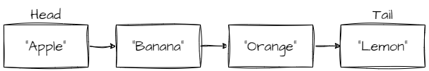
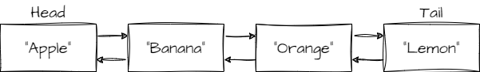
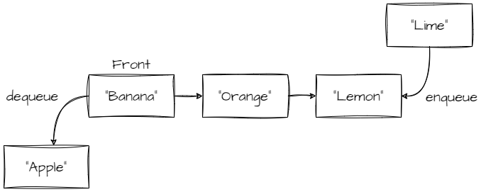
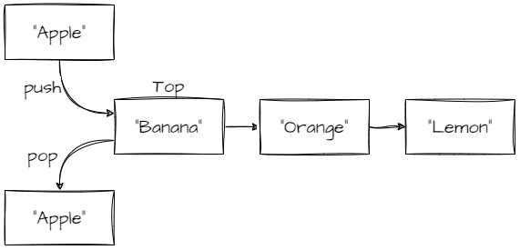
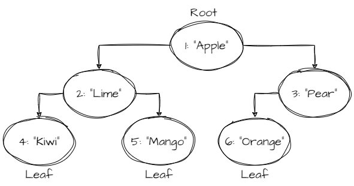
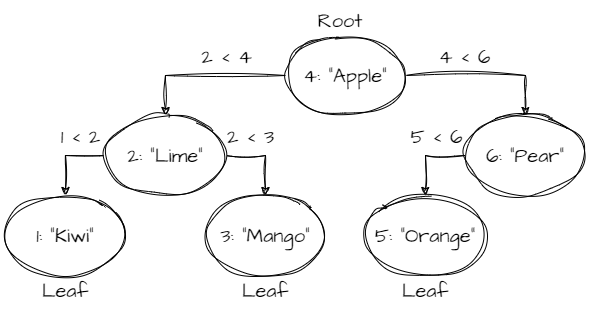

<p align="center">
  
</p>

# Structurify

A collection of fundamental data structures implemented in TypeScript, widely used in computer science and software development. This library includes implementations of various structures that can be effortlessly imported and employed in your projects.

Included Data Structures:

- [Singly Linked List](#singly-linked-list),
- [Doubly Linked List](#doubly-linked-list),
- [Queue](#queue),
- [Stack](#stack),
- [Binary Tree](#binary-tree),
- [Binary Search Tree](#binary-search-tree)

## Installation and Usage

### npm

```
npm i structurify --save
```

### esm

```ts
import {
  SinglyLinkedList, DoublyLinkedList, Queue, Stack, BinaryTree, BinarySearchTree,
} from 'structurify';
```

### commonJS

```ts
const {
  SinglyLinkedList, DoublyLinkedList, Queue, Stack, BinaryTree, BinarySearchTree,
} = require('structurify');
```

## Singly Linked List
A linear data structure where elements (nodes) are linked in a sequential manner, each pointing to the next node in the sequence.
- Provides methods for insertion, deletion, traversal, and access.
- Useful for scenarios requiring efficient insertion and deletion at the beginning or end of the list.



### `SinglyLinkedList<T>`

Represents a singly linked list.

#### Constructor
- `SinglyLinkedList()`: Initializes an empty singly linked list.

#### Properties:
- `get head: SLLNode<T> | null`: Reference to the head node of the list.
- `get isEmpty: boolean`: Indicates whether the list is empty or not.
- `get size: number`: The size of the list.
- `get tail: SLLNode<T> | null`: Reference to the tail node of the list.

#### Static Methods:
- `static fromArray<T>(data: T[]): SinglyLinkedList<T>`: Creates a singly linked list from an array.

#### Instance Methods:
- `at(index: number): T | undefined`: Gets the value at the specified index.
- `clear(): void`: Clears the linked list by resetting its properties.
- `deleteAt(index: number): T | undefined`: Deletes the value at the specified index.
- `insertAt(index: number, val: T): boolean`: Inserts a value at the specified index.
- `nodeAt(index: number): SLLNode<T> | null`: Gets the node at the specified index.
- `pop(): T | undefined`: Removes and returns the value from the end of the list.
- `push(val: T): SinglyLinkedList<T>`: Adds a new node with the provided value to the end of the list.
- `reverse(): SinglyLinkedList<T>`: Reverses the order of the nodes in the list.
- `rotateByN(n: number): SinglyLinkedList<T>`: Rotates the list by the specified number of positions.
- `setAt(index: number, val: T): boolean`: Sets the value at the specified index.
- `shift(): T | undefined`: Removes and returns the value from the beginning of the list.
- `toArray(): T[]`: Converts the list to an array.
- `unshift(val: T): SinglyLinkedList<T>`: Adds a new node with the provided value to the beginning of the list.

### How to use
```ts
// Example usage
import { SinglyLinkedList } from 'structurify';

const myList = new SinglyLinkedList<number>();
myList.push(5).push(10).push(15);

console.log(myList.toArray()); // Output: [5, 10, 15]

myList.pop();
console.log(myList.toArray()); // Output: [5, 10]
```

### Time and Space complexity
| Method      | Time Complexity | Space Complexity |
|-------------|-----------------|------------------|
| `at`        | O(n)            | O(1)             |
| `clear`     | O(1)            | O(1)             |
| `deleteAt`  | O(n)            | O(1)             |
| `fromArray` | O(n)            | O(n)             |
| `insertAt`  | O(n)            | O(1)             |
| `nodeAt`    | O(n)            | O(1)             |
| `pop`       | O(n)            | O(1)             |
| `push`      | O(1)            | O(1)             |
| `reverse`   | O(n)            | O(1)             |
| `rotateByN` | O(n)            | O(1)             |
| `shift`     | O(1)            | O(1)             |
| `setAt`     | O(n)            | O(1)             |
| `toArray`   | O(n)            | O(n)             |
| `unshift`   | O(1)            | O(1)             |

## Doubly Linked List
Similar to the Singly Linked List, but each node also has a reference to the previous node, allowing two-way traversal.
- Supports insertion, deletion, and traversal from both ends.
- Well-suited for applications needing easy access to previous elements.



### `DoublyLinkedList<T>`

Represents a doubly linked list.

#### Constructor
- `DoublyLinkedList()`: Initializes an empty double linked list.

#### Properties:
- `get head: SLLNode<T> | null`: Reference to the head node of the list.
- `get isEmpty: boolean`: Indicates whether the list is empty or not.
- `get size: number`: The size of the list.
- `get tail: SLLNode<T> | null`: Reference to the tail node of the list.

#### Static Methods:
- `static fromArray<T>(data: T[]): DoublyLinkedList<T>`: Creates a double linked list from an array.

#### Instance Methods:
- `at(index: number): T | undefined`: Gets the value at the specified index.
- `clear(): void`: Clears the linked list by resetting its properties.
- `deleteAt(index: number): T | undefined`: Deletes the value at the specified index.
- `insertAt(index: number, val: T): boolean`: Inserts a value at the specified index.
- `nodeAt(index: number): SLLNode<T> | null`: Gets the node at the specified index.
- `pop(): T | undefined`: Removes and returns the value from the end of the list.
- `push(val: T): DoublyLinkedList<T>`: Adds a new node with the provided value to the end of the list.
- `reverse(): DoublyLinkedList<T>`: Reverses the order of the nodes in the list.
- `setAt(index: number, val: T): boolean`: Sets the value at the specified index.
- `shift(): T | undefined`: Removes and returns the value from the beginning of the list.
- `toArray(): T[]`: Converts the list to an array.
- `unshift(val: T): DoublyLinkedList<T>`: Adds a new node with the provided value to the beginning of the list.

### How to use
```ts
import { DoublyLinkedList } from 'structurify';

const dll = new DoubleLinkedList<number>();
dll.push(5).push(10).push(15);

console.log(dll.toArray()); // Output: [5, 10, 15]

dll.reverse();
console.log(dll.toArray()); // Output: [15, 10, 5]

dll.deleteAt(1);
console.log(dll.toArray()); // Output: [15, 5]
```

### Time and Space complexity
| Method      | Time Complexity | Space Complexity |
|-------------|-----------------|------------------|
| `at`        | O(n)            | O(1)             |
| `clear`     | O(1)            | O(1)             |
| `deleteAt`  | O(n)            | O(1)             |
| `fromArray` | O(n)            | O(n)             |
| `insertAt`  | O(n)            | O(1)             |
| `nodeAt`    | O(n)            | O(1)             |
| `pop`       | O(1)            | O(1)             |
| `push`      | O(1)            | O(1)             |
| `reverse`   | O(n)            | O(1)             |
| `shift`     | O(1)            | O(1)             |
| `setAt`     | O(n)            | O(1)             |
| `toArray`   | O(n)            | O(n)             |
| `unshift`   | O(1)            | O(1)             |

## Queue
Follows the First In, First Out (FIFO) principle, allowing data to be inserted from one end (rear) and removed from the other end (front).
- Offers methods like enqueue (add to the rear) and dequeue (remove from the front).
- Useful in scenarios where data needs to be processed in a sequential order.



### `Queue<T>`
Queue class represents a basic queue data structure that follows the First-In-First-Out (FIFO) principle.
It uses a singly linked list internally for efficient enqueue and dequeue operations.

#### Constructor
- `Queue()`: Creates an instance of the Queue class.

#### Properties:
- `get isEmpty(): : boolean`: Checks if the queue is empty.
- `get front(): T | undefined`: Retrieves the value at the front of the queue.
- `get rear(): T | undefined`: Retrieves the value at the rear of the queue.
- `get size(): number`: Returns the number of elements in the queue.

#### Instance Methods:
- `clear(): void`: Removes all elements from the queue.
- `dequeue(): T | undefined`: Removes and returns the element from the front of the queue.
- `enqueue(val: T): number`: Adds an element to the rear of the queue and returns the new size of the queue.
- `peek(): T | undefined`: Retrieves the value at the front of the queue without removing it.
- `peekRear(): T | undefined`: Retrieves the value at the rear of the queue without removing it.
- `toArray(): T[]`: Returns an array representation of the queue.

### How to use
```ts
import { Queue } from 'structurify';

const queue = new Queue<number>();

queue.enqueue(5);
queue.enqueue(10);
queue.enqueue(15);

console.log(queue.dequeue()); // Output: 5

console.log(queue.peek()); // Output: 10

console.log(queue.toArray()); // Output: [10, 15]

queue.clear();

console.log(queue.isEmpty); // Output: true
```

### Time and Space complexity
| Method     | Time Complexity | Space Complexity |
|------------|-----------------|------------------|
| `clear`    | O(1)            | O(1)             |
| `dequeue`  | O(1)            | O(1)             |
| `enqueue`  | O(1)            | O(1)             |
| `peek`     | O(1)            | O(1)             |
| `peekRear` | O(1)            | O(1)             |
| `toArray`  | O(n)            | O(n)             |

## Stack
Adheres to the Last In, First Out (LIFO) principle, enabling data to be added and removed from the same end (top).
- Provides methods such as push (add to the top) and pop (remove from the top).
- Commonly used in applications involving function calls, expression evaluation, and backtracking.
  


### `Stack<T>`
Represents a stack data structure that follows the Last-In-First-Out (LIFO) principle.
It uses a singly linked list internally for efficient enqueue and dequeue operations.

#### Constructor
- `Stack()`: Creates an instance of the Stack class.

#### Properties:
- `get isEmpty(): : boolean`: Checks if the stack is empty.
- `get size(): number`: Returns the number of elements in the stack.
- `get top(): T | undefined`: Retrieves the value at the top of the stack.

#### Instance Methods:
- `clear(): void`: Removes all elements from the stack.
- `peek(): T | undefined`: Retrieves the value at the top of the stack without removing it.
- `pop(): T | undefined`: Removes and returns the element from the top of the stack.
- `push(val: T): void`: Adds a new element to the top of the stack.
- `toArray(): T[]`: Returns an array representation of the stack.

### How to use
```ts
import { Stack } from 'structurify';

const stack = new Stack<number>();

stack.push(5);
stack.push(10);
stack.push(15);

console.log(stack.pop()); // Output: 15
console.log(stack.peek()); // Output: 10
console.log(stack.toArray()); // Output: [10, 5]

stack.clear();

console.log(stack.isEmpty); // Output: true
```

### Time and Space complexity
| Method    | Time Complexity | Space Complexity |
|-----------|-----------------|------------------|
| `clear`   | O(1)            | O(1)             |
| `peek`    | O(1)            | O(1)             |
| `pop`     | O(1)            | O(1)             |
| `push`    | O(1)            | O(1)             |
| `toArray` | O(n)            | O(n)             |

## Binary Tree
A node-based tree data structure in which each node can have at most two children, which are referred to as the left child and the right child.



### How to use
```ts
import { BinaryTree, TraversalOrder } from 'structurify';

const tree = new BinaryTree<number, string>(); 

tree.add(1, 'Apple');
tree.add(2, 'Lime');
tree.add(3, 'Pear');
tree.add(4, 'Kiwi');
tree.add(5, 'Mango');
tree.add(6, 'Orange');

console.log(tree.size) // 6

for (let fruit of tree.values(TraversalOrder.LevelOrder)) {
  console.log(fruit) // 'Apple', 'Lime' 'Pear', 'Kiwi', 'Mango', 'Orange'
}
```

### API Reference
For detailed information, please refer to the [Binary Tree API Reference](src/binary-tree/docs/class-api/binary-tree.md).

### Time and Space complexity
| Method                        | Time Complexity | Space Complexity |
|-------------------------------|-----------------|------------------|
| `static fromEntries(entries)` | O(n)            | O(w)             |
| `add(key, val)`               | O(n)            | O(w)             |
| `addMany(entries)`            | O(n log n)      | O(log n)         |
| `delete(key)`                 | O(n)            | O(w)             |
| `get(key, order)`             | O(n)            | O(h) or O(w)     |
| `has(key, order)`             | O(n)            | O(h) or O(w)     |
| `set(key, val, order)`        | O(n)            | O(h) or O(w)     |
| `node(key)`                   | O(n)            | O(h) or O(w)     |

#### Inherited from `BaseBinaryTree`

| Method                 | Time Complexity | Space Complexity |
|------------------------|-----------------|------------------|
| `clear()`              | O(1)            | O(1)             |
| `entries(order)`       | O(n)            | O(h) or O(w)     |
| `every(fn, order)`     | O(n)            | O(h) or O(w)     |
| `findNode(fn, order)`  | O(n)            | O(h) or O(w)     |
| `findValue(fn, order)` | O(n)            | O(h) or O(w)     |
| `forEach(fn, order)`   | O(n)            | O(h) or O(w)     |
| `isEqual(root)`        | O(n)            | O(h)             |
| `isBalanced()`         | O(n)            | O(h)             |
| `isComplete()`         | O(n)            | O(w)             |
| `isFull()`             | O(n)            | O(h)             |
| `isPerfect()`          | O(n)            | O(h)             |
| `keys(order)`          | O(n)            | O(h) or O(w)     |
| `maxDepth()`           | O(n)            | O(h)             |
| `some(fn, order)`      | O(n)            | O(h) or O(w)     |
| `values(order)`        | O(n)            | O(h) or O(w)     |

- **n** - the number of nodes in the binary tree.
- **h** - the height of the binary tree.
- **w** - the maximum width of the binary tree.

## Binary Search Tree
A node-based binary tree data structure which has the following properties:

- The left subtree of a node contains only nodes with keys lesser than the node’s key.
- The right subtree of a node contains only nodes with keys greater than the node’s key.
- The left and right subtree each must also be a binary search tree.



### How to use
```ts
import { BinarySearchTree, TraversalOrder } from 'structurify';

const tree = new BinarySearchTree.fromSortedEntries<number, string>([
  [1, 'Kiwi'],
  [2, 'Lime'],
  [3, 'Mango'],
  [4, 'Apple'],
  [5, 'Orange'],
  [6, 'Pear'],
]);

console.log(tree.size) // 6

for (let fruit of tree.values(TraversalOrder.InOrder)) {
  console.log(fruit) // 'Kiwi', 'Lime' 'Mango', 'Apple', 'Orange', 'Pear'
}
```

### API Reference
For detailed information, please refer to the [Binary Search Tree API Reference](src/binary-tree/docs/class-api/binary-search-tree.md).

### Time and Space complexity
| Method                                          | Time Complexity | Space Complexity |
|-------------------------------------------------|-----------------|------------------|
| `static fromEntries(entries, comparator)`       | O(n log n)      | O(log n)         |
| `static fromSortedEntries(entries, comparator)` | O(n)            | O(log n)         |
| `add(key, val)`                                 | O(log n)        | O(log n)         |
| `addMany(entries)`                              | O(n log n)      | O(log n)         |
| `delete(key)`                                   | O(log n)        | O(log n)         |
| `get(key)`                                      | O(log n)        | O(1)             |
| `has(key)`                                      | O(log n)        | O(1)             |
| `set(key, val)`                                 | O(log n)        | O(1)             |
| `node(key)`                                     | O(log n)        | O(1)             |

#### Inherited from `BaseBinaryTree`
| Method                 | Time Complexity | Space Complexity |
|------------------------|-----------------|------------------|
| `clear()`              | O(1)            | O(1)             |
| `entries(order)`       | O(n)            | O(h) or O(w)     |
| `every(fn, order)`     | O(n)            | O(h) or O(w)     |
| `findNode(fn, order)`  | O(n)            | O(h) or O(w)     |
| `findValue(fn, order)` | O(n)            | O(h) or O(w)     |
| `forEach(fn, order)`   | O(n)            | O(h) or O(w)     |
| `isEqual(root)`        | O(n)            | O(h)             |
| `isBalanced()`         | O(n)            | O(h)             |
| `isComplete()`         | O(n)            | O(w)             |
| `isFull()`             | O(n)            | O(h)             |
| `isPerfect()`          | O(n)            | O(h)             |
| `keys(order)`          | O(n)            | O(h) or O(w)     |
| `maxDepth()`           | O(n)            | O(h)             |
| `some(fn, order)`      | O(n)            | O(h) or O(w)     |
| `values(order)`        | O(n)            | O(h) or O(w)     |

- **n** - the number of nodes in the binary tree.
- **h** - the height of the binary tree.
- **w** - the maximum width of the binary tree.