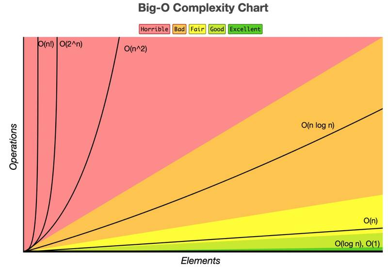

# Algorithms in JavaScript

## Contents
1. [Important algorithm concepts](#important-algorithm-concepts)
   * [Big O Notation](#big-o-notation)
   * [Algorithm stability](#algorithm-stability)
   * [In-place algorithms](#in-place-algorithms)
   * [Comparison algorithms](#comparison-algorithms)
   * [More about Algorithm Concepts](#more-about-algorithm-concepts)
2. [Recursion](#recursion)
   * [The Three Parts of a Recursive Function](#the-three-parts-of-a-recursive-function)
   * [Recursion vs Loops](#recursion-vs-loops)
   * [More about Recursion](#more-about-recursion)
3. [Searching Algorithms](#searching-algorithms)
   * [Liner search](searching/linear)
   * [Binary Search](searching/binary)
4. [Sorting Algorithms](#sorting-algorithms)
   * [Bubble Sort](sorting/bubble)
   * [Selection Sort](sorting/selection)
   * [Insertion Sort](sorting/insertion)

## Important algorithm concepts

### Big O Notation

Big O Notation is used to analyse the performance of an algorithm. It specifically looks at the worst-case scenario of an algorithm.

It tells us how long a function will take to execute or how much space in memory will be taken up as the input to that function approaches infinity (becomes very large).



Algorithms with Big O(1) are as good as it gets: if we increase the size of the input, the execution time remains constant.

Algorithms with Big O(n!) are “horrible”: if we increase the input size even just a little, the execution time can rise dramatically.

Big O is a very important concept, and is fundamental to understanding algorithms

### Algorithm stability

Stable means that two elements with equal values will appear in the same order in the sorted output as they appear in the unsorted input array.

| Stable sorting algorithms | Unstable sorting algorithms |
|---------------------------|-----------------------------|
| Bubble Sort               | Selection Sort              |
| Insertion Sort            | Heap Sort                   |
| Merge Sort                | Quick Sort                  |
| Radix Sort                |                             |

### In-place algorithms

An in-place sorting algorithm is an algorithm which transforms input using no auxiliary data structures; however, a small amount of extra storage space is allowed for auxiliary variables.

In simple terms, “in-place” just means that the input is overwritten (via swapping or replacement) by the output as the algorithm executes.

In-place algorithms have good space-complexity (take up less space in memory).

The opposite of an in-place algorithm is an out-of-place algorithm, which does require auxiliary data structures.

| In-place algorithms | Out-of-place |
|---------------------|--------------|
| Bubble Sort         | Merge Sort   |
| Selection Sort      |              |
| Insertion Sort      |              |
| Heap Sort           |              |

### Comparison algorithms

A comparison sorting algorithm is an algorithm that only reads a list of elements through a single abstract comparison operation (usually a “less than” or “equal to”) that determines which of the two elements should occur first in the final sorted output array.

**Comparison sorting algorithms:** *Bubble Sort*, *Selection Sort*, *Insertion Sort*, *Merge Sort*, *Quick Sort*.

**Non-comparison-type sorting algorithm:** *Radix Sort*

### More about Algorithm Concepts

* [Searching and Sorting Algorithms in JavaScript | The Ultimate Guide](https://www.doabledanny.com/searching-and-sorting-algorithms-in-javascript)
* [Big O Notation in JavaScript | The Ultimate Beginners Guide with Examples](https://www.doabledanny.com/big-o-notation-in-javascript)
* [Important Algorithm Concepts | Algorithm Stability, In-place Algorithms, and Comparison Algorithms](https://www.doabledanny.com/algorithm-concepts)

## Recursion

Recursion is a problem-solving technique in programming.

A recursive function is a function that calls itself somewhere within the body of the function. Below is a basic example of a recursive function.

```js
function recursiveFunc() {
  // some code here... 
  recursiveFunc()
}
```
### The Three Parts of a Recursive Function

* The function definition.
* The base condition.
* The recursive call.

```js
  function doSomething(n) {
    if (n === 0) { // <= Base condition
      console.log("TASK COMPLETED!")
      return;
    }
    
    console.log("I'm doing something.")
  
    doSomething(n - 1) // <= The recursive call
  }
  
  doSomething(3)
```

When using a recursive function, **the base condition** is what lets the function know when to stop calling itself. Once the base condition is met, the recursion ends. Without the base condition, you will run into infinite recursion. Also, without a base condition, your function exceeds **the maximum call stack**.

**The recursive call** is what handles the function calling itself again. On every iteration of a recursive call, the parameter will differ from that of the previous call. The function will keep calling itself until the new parameter satisfies the base condition.

### Recursion vs Loops

Recursion and loops work in similar ways. Every recursive function you write has an alternative solution with a loop.

### More about Recursion

* [What is Recursion in JavaScript?](https://www.freecodecamp.org/news/recursion-in-javascript/)

## Searching Algorithms

Search algorithms are used to retrieve some information stored in a data structure.

For example, we could search an array (the data structure) for the value 8 (some information).

Usually, a searching algorithm will return the position of the found value, or if it isn’t found, it will return -1.

So, if we searched ``[1, 2, 3]`` for the value 2, then we’d get back 1 – the index of the found value.

If we searched the same array for 5, we’d get back -1; i.e. value not found.

* [Liner search](searching/linear)
* [Binary Search](searching/binary)

## Sorting Algorithms

Sorting algorithms are used to organize an array of elements into a specific order. Usually, the sorting order is lexicographical – e.g. alphabetical (a-z) or numerical (0-9).

```
[3, 7, 5, 1] => Sorting... => [1, 3, 5, 7]
```

* [Bubble Sort](sorting/bubble)
* [Selection Sort](sorting/selection)
* [Insertion Sort](sorting/insertion)
