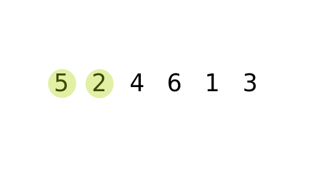

# Bubble Sort in JavaScript

Bubble Sort is a straighthood, easy to understand sorting algorithm. It works by looping through an array and comparing neighbouring elements, then swapping them if they are in the wrong order. In this fashion, the largest number “bubbles” to the top. This is repeated until the array is sorted.

## Bubble sort step-by-step

1. Start at the beginning of the array.
1. Is the adjacent element to the right less? If so, swap.
1. Move up to next element.
1. Repeat steps 2-3 until array is sorted.

## Performance summary

| Title                         | Value      |
|-------------------------------|------------|
| **Time complexity (best)**    | O(n)       |
| **Time complexity (average)** | O(n^2)     | 
| **Time complexity (worst)**   | O(n^2)     | 
| **Space complexity (worst)**  | O(1)       |
| **In-place/out-of-place?**    | In-place   |   
| **Stability?**                | Stable     | 
| **Comparison Sort?**          | Comparison |